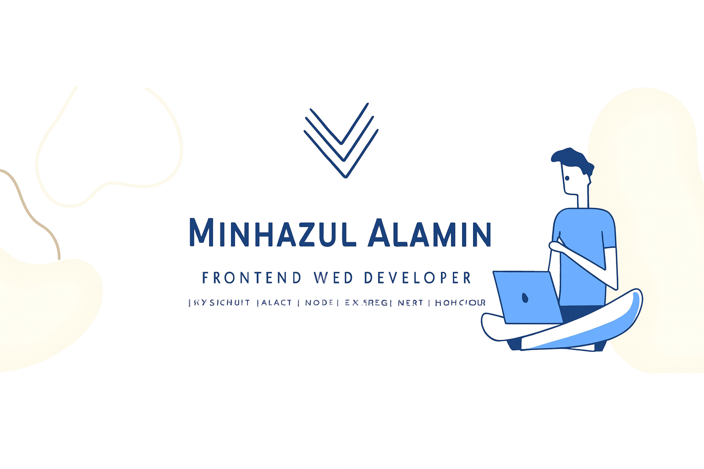

  

<h1 align="center">About Me</h1>
 
Hi, I'm Minhazul Alamin

A passionate **Frontend Developer** & **MERN Stack Developer**, focused on creating **fast, scalable, and modern web applications**.

<h4>I'm currently learning React.js</h4>

## 🌐 Connect with Me:

 

##  Tech Stack

###  **Frontend Development**

###  **Backend Development**

###  **Tools & Technologies**

# 📊 GitHub Stats:

 

 
S

  

